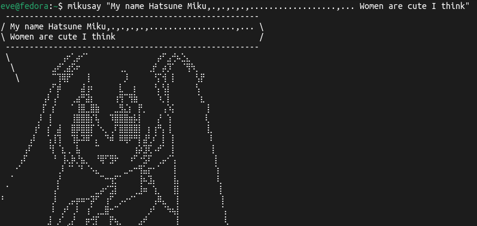

# MikuSay

Small *say program for Hatsune Miku!


## Installation
You must have `rustup` and `git` installed on your system.
```bash
git clone https://its-Lyn/github.com/its-Lyn/mikusay
cd mikusay

./install.sh
```
If `install.sh` doesn't work at first, try to run `chmod +x ./install.sh`.

To uninstall run `./install.sh --remove`

## License
MIT